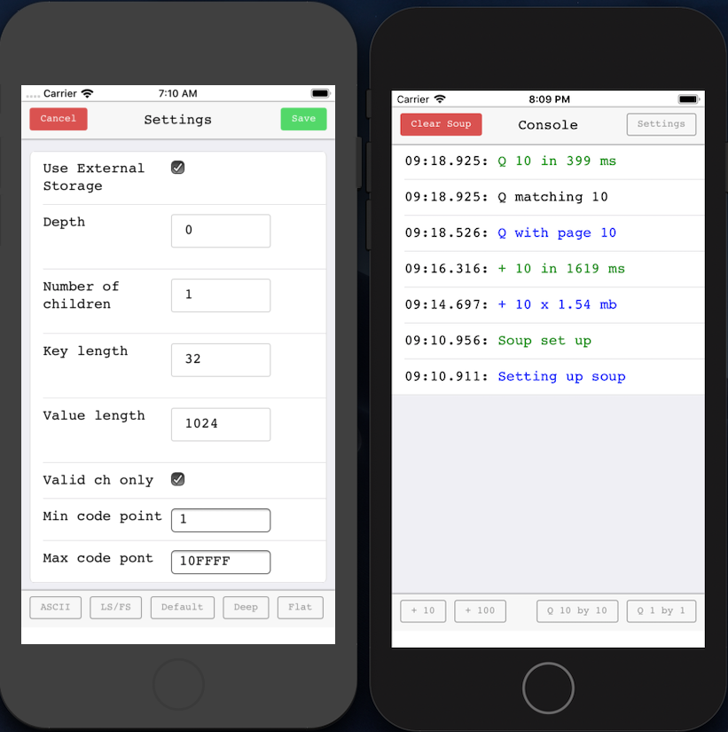

# Simple application that tries to corrupt SmartStore

## Quick links
1. [Overview](#1-overview)
2. [Setup](#2-setup)
3. [Development](#3-development)
4. [Issues discovered](#4-issues-discovered)

## 1. Overview

 

### Settings screen
Through the settings screen one can control the shape of the records and whether to use external storage or not:
- use external storage: whether to use external storage or not.
- depth: depth of json objects.
- number of children: number of branches at each level of the json object.
- key length: length of keys in json object.
- value length: length of leaf values in json object.
- min/max character code: smallest/largest character code to use in random strings generated for keys and leaf value.

Actions:
- save: to update settings and go to console screen. If you change the storage type, the soup gets recreated.
- cancel: to go to console screen without updating settings.

### Console screen:
Through the console screen, insert and query records from smartstore.

Actions:
- settings: bring up Settings screen.
- clear soup: to empty the soup.
- +10, +100: to insert 10 or 100 large records. The size of records inserted (and the time it took are reported).
- Q 1 by 1, Q 10 by 10: to query all records from the soup with a page size of 1 and 10 respectively. The number of records founds / expected (and the time it took) are reported..

Screen shows ouput for most recent operation first:
- Blue is for the beginning of an operation.
- Green is for the end of an operation.
- Red is for errors.

## 2. Setup

### First time setup
After cloning this repo, you should do:
```shell
./install.sh
```
NB: you need forcehybrid installed.

### Running the application
To bring up the application in XCode do:
```shell
open ./app/platforms/ios/CorruptionTester.xcworkspace
```
## 3. Development

### Modifying the application locally
Edit files in `./app/platforms/ios/www/`.
If you have Safari web inspector connected (more info [here](https://developer.apple.com/library/archive/documentation/AppleApplications/Conceptual/Safari_Developer_Guide/GettingStarted/GettingStarted.html)), you can simply do a `reload`. You don't need to relaunch the application.

### Modifying the application for github
Copy any files you changed from to `./app/platforms/ios/www/` to `./www`.

### Pointing to a different version of the Mobile SDK
Simply edit `./app/platforms/ios/Podfile` and change where to get the libraries from.
For instance, if you used forcehybrid 7.2, it would look something like:
```ruby
platform :ios, '11.0'
use_frameworks!
target 'CorruptionTester' do
	pod 'SalesforceHybridSDK', :git => 'https://github.com/forcedotcom/SalesforceMobileSDK-iOS-Hybrid', :tag => 'v7.2.0'
	pod 'Cordova', :git => 'https://github.com/forcedotcom/cordova-ios', :branch => 'cordova_5.0.0_sdk'
	pod 'SmartSync', :git => 'https://github.com/forcedotcom/SalesforceMobileSDK-iOS', :tag => 'v7.2.0'
	pod 'SmartStore', :git => 'https://github.com/forcedotcom/SalesforceMobileSDK-iOS', :tag => 'v7.2.0'
	pod 'FMDB/SQLCipher', :git => 'https://github.com/ccgus/fmdb', :tag => '2.7.5'
	pod 'SQLCipher/fts', :git => 'https://github.com/sqlcipher/sqlcipher', :tag => 'v4.2.0'
	pod 'SalesforceSDKCore', :git => 'https://github.com/forcedotcom/SalesforceMobileSDK-iOS', :tag => 'v7.2.0'
	pod 'SalesforceAnalytics', :git => 'https://github.com/forcedotcom/SalesforceMobileSDK-iOS', :tag => 'v7.2.0'
	pod 'SalesforceSDKCommon', :git => 'https://github.com/forcedotcom/SalesforceMobileSDK-iOS', :tag => 'v7.2.0'
end
```

### Looking at the externally stored files (when using simulator)
First find the directory for that soup:
```shell
cd ~/Library/Developer/CoreSimulator/Devices/
find . -name TABLE_1
```
Disable encrypting of externally stored files by editing `SFSmartStore.m`, replace `SFSmartStoreEncryptionKeyBlock keyBlock = [SFSmartStore encryptionKeyBlock];` with `SFSmartStoreEncryptionKeyBlock keyBlock = nil;` in:
- `loadExternalSoupEntryAsString:soupTableName` 
- `saveSoupEntryExternally:soupEntryId:soupTableName`

To pretty a json file do:
```shell
cat soupelt_xxx | python -mjson.tool
```
### To see what's coming from JavaScript
Add the following to `CDVWKWebViewEngine.m`'s `userContentController:didReceiveScriptMessage`:
```objective-c
NSLog(@"wkscriptmessage---->%@", message.body);
```

### To see what's going to JavaScript
Add the following to `CDVCommandDelegateImpl.m`'s `evalJsHelper2`
```objective-c
NSLog(@"js---->%@", js);
```

## 4. Issues discovered

### Bug in saveSoupEntryExternally
When we upsert soup entries that are stored in external files, we use `NSJSONSerialization:writeJSONObject` to write the JSON to a file.
That method can fail if with certain unicode characters. 
`saveSoupEntryExternally` should exit with an error, causing the `upsert` to revert.
Unfoturnately, we were looking at the return value `NSJSONSerialization:writeJSONObject` to decide if an error occurred.
But this method returns the number of bytes written so it could return a non zero value even though it fails to write the entire JSON.
As a result, the file will be cut-off, which will cause issues at query time.
PR: https://github.com/forcedotcom/SalesforceMobileSDK-iOS/pull/2982

**Problem: not happening all the time ??**

### LS/PS handling in JSON vs JavaScript
Line separator "LS" (U+2028 - character code 8232) and paragraph separator "PS" (U+2029 - character code 8233) are considered line terminators in JavaScript (so need to be escaped in a string) but not in JSON !

For more information see http://timelessrepo.com/json-isnt-a-javascript-subset. 
Interestingly, JSON and JavaScript might finally line up in ES2019: https://v8.dev/features/subsume-json.

As a result, a stringified JSON containing non-escaped LS or PS, given to JavaScript should produce a syntax error.

Possible fix:
Fix Cordova evalJs method to escape those characters before sending them in the webview. Here is another bridge that does just that: https://github.com/Lision/WKWebViewJavascriptBridge/blob/master/WKWebViewJavascriptBridge/WKWebViewJavascriptBridgeBase.swift#L112)
PR: https://github.com/forcedotcom/SalesforceMobileSDK-iOS-Hybrid/pull/94

**Problem: happening on 11.4 but not on 12 or 13**
